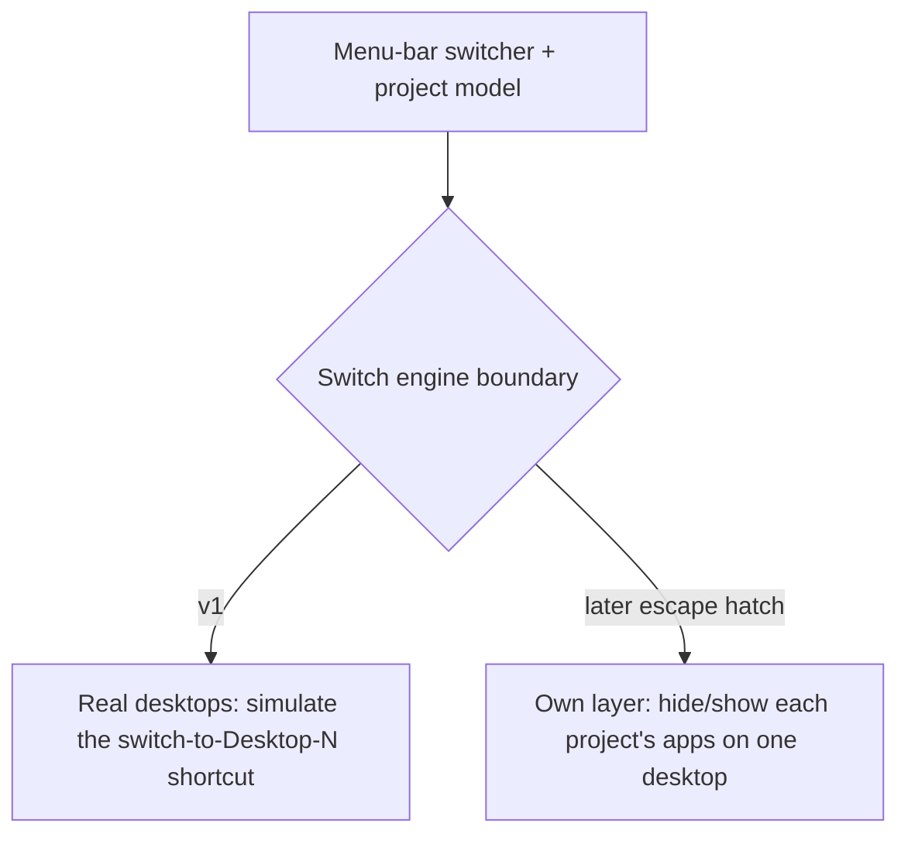

# Parallel Project Desktops — Requirements (v1 / MVP)

## Summary

A menu-bar macOS app that turns each of a solo founder's ~7–10 macOS desktops into a named *project*. You jump to a project from the menu bar (or by typing its name); entering a project opens its apps on its desktop; leaving and returning shows a short "where you left off" note. It is the layer above naming — what Desktop Space Renamer does, plus blueprint boot and resume.

## Problem Frame

A solo founder runs several workstreams at once — multiple products, content, sales, admin — and wants each to keep running in parallel without losing the thread. macOS already has virtual desktops, but they are unlabeled ("Desktop 1, 2, 3"), give no overview of what lives where, and force you to remember which number is which. There is no system for "this desktop is the Sales project," no fast way to jump to the right one, and no help recovering context after you switch away for a day. The pain is greatest at two moments: choosing where to go (which desktop holds what), and arriving back at a project cold (re-finding what you were doing). Today the user has no systematic tooling for either.

## Key Decisions

- **Use Apple's real desktops, one per project — not the app's own workspace layer.** Familiar, simple, and proven (the $5 Desktop Space Renamer ships on this exact approach). It caps near 10 desktops, which fits the 7–10 target. The app's own workspace layer — hiding/showing each project's apps on a single desktop, AeroSpace-style — is the deliberate later escape hatch for when projects exceed ~10 or the product needs full window-visibility control. It is explicitly out of v1.

- **Switch via the macOS "switch to Desktop N" shortcut, behind a swappable switch-engine seam.** Simulating the Ctrl-number shortcut is the only mechanism available without disabling system security. All switching goes through one internal boundary so the own-layer engine can replace it later without touching the menu-bar UI or the project model.

- **Entering a project opens its apps but does not arrange windows in v1.** Real desktops already keep each app's windows on their desktop while the app runs, so "stays set up" lands without the least-reliable macOS capability (resizing windows across arbitrary apps). v1 passively records window positions so layout-restore becomes an easy later addition rather than a rewrite.

- **Create a project by capturing what's already open on a desktop, then naming it.** No config form. The captured app set becomes the project's blueprint, editable afterward. Auto-learning the app set by watching usage is deferred.

- **The Ctrl-number fragility is accepted for v1, mitigated rather than re-architected.** It is the load-bearing risk: it breaks if the shortcuts are disabled or desktop indices drift. v1 handles this with onboarding (enable the shortcuts) and self-recalibration (re-bind project-to-desktop on drift), not by moving to the own-layer engine now.

## Key Flows

- F1. Create a project
  - **Trigger:** User is on a desktop with their working apps open and chooses "Save this desktop as a project."
  - **Steps:** App reads the apps open on the active desktop; user gives the project a name + label; app stores the app set as the blueprint and binds the project to this desktop.
  - **Covered by:** R1, R2

- F2. Switch to a project
  - **Trigger:** User opens the menu-bar list or the type-to-search bar and picks a project.
  - **Steps:** Switch engine moves to that project's desktop. If index drift is detected first, switching pauses and recalibration is offered instead.
  - **Covered by:** R7, R8, R9, R15

- F3. Enter / boot a project
  - **Trigger:** User switches into a project whose blueprint apps are not all running.
  - **Steps:** App switches to the desktop and launches only the blueprint apps that aren't already open; running apps are left in place.
  - **Covered by:** R4

- F4. Leave and resume
  - **Trigger:** User switches away from a project's desktop.
  - **Steps:** App records the front app + window title; optionally prompts for a one-line note. On return, it shows a transient card with that context.
  - **Covered by:** R10, R11, R12

- F5. Morning recap
  - **Trigger:** First app open of the day (or a set time).
  - **Steps:** App shows each project with its last app/title and note; a row click jumps to that project.
  - **Covered by:** R13

## Requirements

**Projects & blueprints**

- R1. A project has a name and a label (emoji and/or color) and is bound to exactly one macOS desktop.
- R2. The user can create a project by capturing the apps currently open on the active desktop; that app set is stored as the project's blueprint.
- R3. The user can edit a project's blueprint (add or remove apps) after creation.
- R4. Entering a project switches to its desktop and launches only the blueprint apps not already running; already-running apps are not relaunched or duplicated.
- R5. While the user is on a project's desktop, the app passively records each blueprint app's last window position and size, without acting on it in v1.
- R6. The app supports 7–10 projects and does not attempt to exceed the macOS real-desktop ceiling.

**Switching & navigation**

- R7. A menu-bar dropdown lists all projects by name and label; selecting one switches to its desktop.
- R8. A keyboard-triggered search bar lets the user type part of a project name and jump to the match.
- R9. All switching passes through a single internal switch-engine boundary so an alternative engine can replace it later without changing the UI or project model.

**Resume & context**

- R10. On leaving a project's desktop, the app records the front app and its window title at that moment.
- R11. The user can add an optional, dismissible one-line "where I stopped" note when leaving.
- R12. On returning to a project, the app shows a transient card with the last front app, its window title, and the note.
- R13. A morning recap lists every project with its last app/title and note; each row jumps to that project.

**Reliability & onboarding**

- R14. First-run onboarding ensures the built-in macOS "Switch to Desktop N" shortcuts are enabled at their default (Control+number) and requests Accessibility permission; the switch engine simulates those default shortcuts. Onboarding may guide the user to toggle the shortcuts on rather than setting them silently.
- R15. The app binds each project to its current desktop index and re-verifies on every desktop-change event; on detected drift it pauses index-based switching and prompts the user to recalibrate rather than switching to the wrong desktop.

## Acceptance Examples

- AE1. **Covers R4.** Given Product A's blueprint is VS Code + Terminal + Chrome and VS Code is already running, when the user enters Product A, then the app switches to its desktop and launches only Terminal and Chrome; VS Code is not relaunched.
- AE2. **Covers R15.** Given a project bound to Desktop 4, when the user removes Desktop 2 (shifting indices), then the next switch does not jump to the now-wrong desktop; the app flags drift and asks the user to recalibrate.
- AE3. **Covers R12.** Given the user left Product A with the note "fixing the Stripe webhook," when they return to Product A, then a card appears showing the last app, its window title, and that note, then fades.
- AE4. **Covers R7, R8.** Given 8 projects exist, when the user types "sa" in the search bar, then "Sales" is highlighted and pressing Enter switches to it.

## Success Criteria

- Switching from the menu bar lands on the correct desktop in roughly a second, and never silently lands on the wrong one — drift is caught, not ignored.
- Creating a project from the currently-open apps takes well under a minute, with no config form.
- After returning to a project, the resume card removes the "where was I?" re-orientation — the user knows the last thing they touched without hunting.
- The app is fully usable from the menu bar; no main window is required.

## Scope Boundaries

**Deferred for later**

- Park/unpark shelf for 15+ projects, and anything that needs to exceed the ~10-desktop cap.
- Window-layout restore (moving/resizing windows into a saved arrangement) and per-monitor docked/laptop layouts with dock/undock reflow.
- Overview wall with thumbnails and live status dots.
- A "which project am I in?" local signal for other tools, and Solo/Mute.
- A desktop / Notification-Center widget (the menu bar is the v1 surface).
- Auto-learning a project's app set from observed usage.
- Remapping the desktop-switch shortcuts to an obscure combination (e.g. a Hyper-key combo) for collision avoidance — reached for only if the default Control+number clashes with the user's own app shortcuts.

**Outside this product's identity**

- A general window manager / tiling tool (Rectangle / Magnet / yabai territory). This is a project-context switcher, not a window tiler.
- Time-tracking or productivity analytics as a primary purpose.
- Restoring exact in-app state (scroll position, a specific browser tab). Infeasible on macOS generically — resume is "remind me," not "teleport me."

## Dependencies / Assumptions

- The user grants Accessibility permission and uses (or will enable) Apple's real desktops and the "switch to Desktop N" keyboard shortcuts.
- macOS keeps each app's windows on the desktop where they were opened while the app runs — the basis for "open apps only" delivering "stays set up."
- Assumption to verify before building: the reliability of simulating the desktop-switch shortcut across the target macOS version. This is the load-bearing mechanism and warrants an early spike.

## Outstanding Questions

**Resolve before planning**

- None blocking — scope is settled. Label scheme (emoji, color, or both) can default and be refined in planning.

**Deferred to planning**

- The exact mechanism for triggering a desktop switch and for detecting desktop add/remove/reorder (simulated key event vs Mission Control accessibility), and how reliable each is.
- How a project's desktop binding is persisted and re-bound after drift.
- Where and how blueprints and resume notes are stored.
- The onboarding flow for enabling the keyboard shortcuts and permissions.

## Sources / Research

- Originating ideation (full ranked idea set, prior art, macOS constraints): `2026-06-20-parallel-project-desktops-ideation.html` (ce-ideate run, saved under the run's temp directory).
- Prior art: Desktop Space Renamer (names real desktops, menu-bar switch, ~10-desktop cap — the floor this builds on); AeroSpace / FlashSpace (own workspace-layer model — the deferred escape-hatch approach); VS Code workspaces / Arc Spaces (per-project setup for a single app's world).
