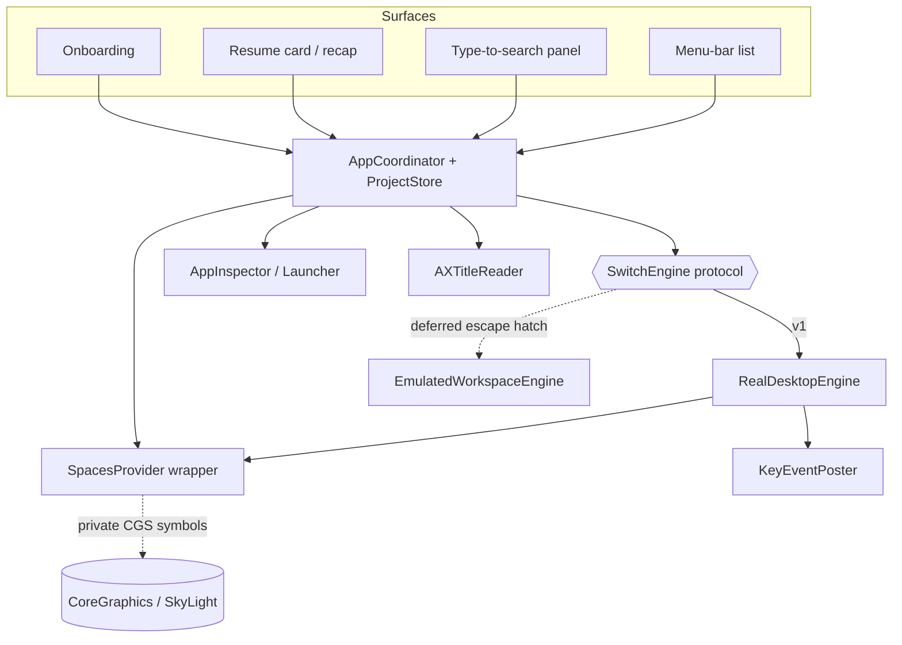
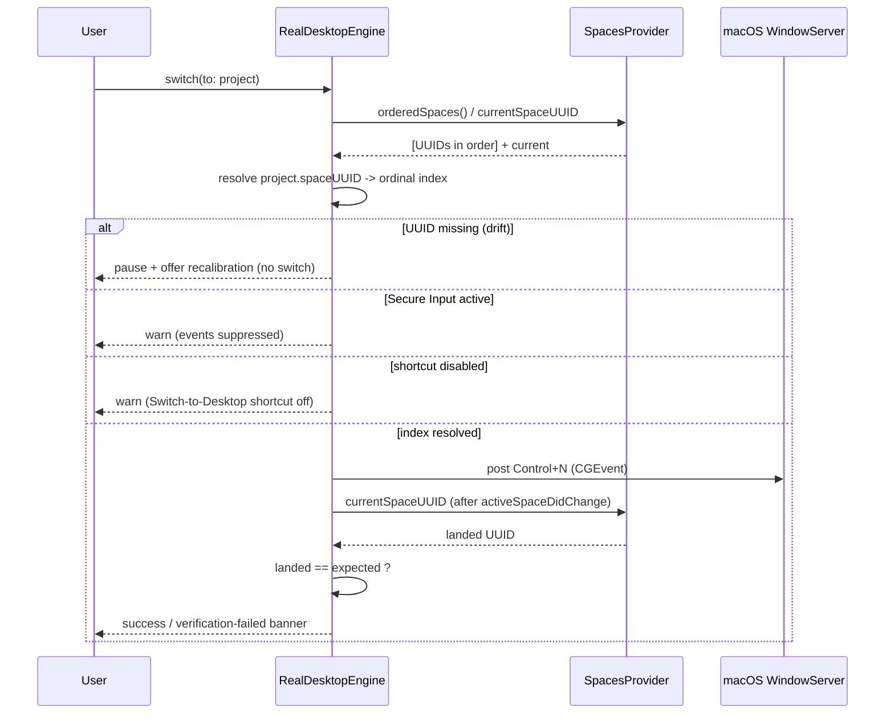
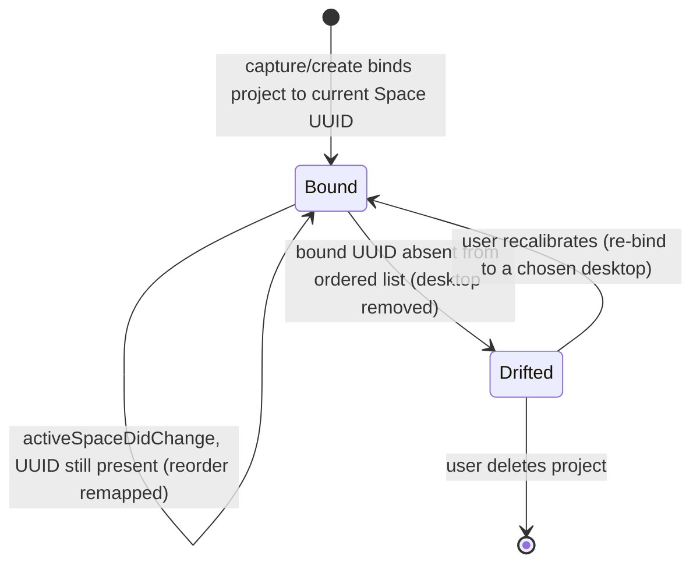

# feat: Parallel Project Desktops — Implementation Plan (v1 / MVP)

A native, menu-bar-only macOS app that turns each real macOS desktop (Space) into a named *project*: capture-to-create, blueprint boot that launches only the missing apps, fast switching from the menu bar or a type-to-search bar, and a "where you left off" resume card plus morning recap — all switching behind one swappable engine seam, with desktop drift caught rather than silently followed to the wrong desktop.

**Origin:** `docs/brainstorms/2026-06-21-parallel-project-desktops-requirements.md` (settled MVP requirements).

**Target tech:** Swift 5.9+/Swift 6, SwiftUI `MenuBarExtra`, targeting macOS 14 Sonoma / 15 Sequoia. **Non-sandboxed, Developer ID + notarized direct download** (not Mac App Store — see KTD-1).

---

## Problem Frame

A solo founder runs several workstreams at once and wants each to keep running in parallel without losing the thread. macOS has virtual desktops, but they are unlabeled, give no overview of what lives where, and force the user to remember which number is which. The pain peaks at two moments: **choosing where to go** (which desktop holds what) and **arriving back cold** (re-finding what you were doing). This app is the layer above naming — named projects, blueprint boot, and resume context — built on Apple's real desktops, the same proven foundation as Desktop Space Renamer.

The load-bearing constraint: macOS exposes **no public API for switching Spaces**. The only mechanism that touches native Spaces without disabling SIP is **synthesizing the user's "Switch to Desktop N" (Control+number) shortcut**, which is fragile (off by default, 16-desktop cap, suppressed by Secure Input). The entire product therefore rests on a mechanism that must be verified first and isolated behind a replaceable seam.

---

## Requirements Traceability

Every origin requirement maps to at least one implementation unit (U-IDs assigned in the Implementation Units section).

| Req | Description | Unit(s) |
|-----|-------------|---------|
| R1 | Project has name + label (emoji/color), bound to one desktop | U6 |
| R2 | Create project by capturing apps open on the active desktop | U7 |
| R3 | Edit a project's blueprint after creation | U7 |
| R4 | Enter project: switch + launch only the not-yet-running blueprint apps | U8 |
| R5 | Passively record each blueprint app's last window position/size (no action in v1) | U9 |
| R6 | Support 7–10 projects; do not exceed the macOS desktop ceiling | U6 |
| R7 | Menu-bar dropdown lists projects by name + label; select switches | U10 |
| R8 | Keyboard-triggered search bar; type part of a name to jump | U11 |
| R9 | All switching passes through one internal switch-engine boundary | U4 |
| R10 | On leaving, record front app + window title | U12 |
| R11 | Optional dismissible one-line "where I stopped" note on leave | U12 |
| R12 | On return, transient card with last app, title, note | U12 |
| R13 | Morning recap lists every project with last app/title/note; row jumps | U13 |
| R14 | First-run onboarding: enable Control+number shortcuts + Accessibility | U14 |
| R15 | Bind project to desktop, re-verify on change; pause + recalibrate on drift | U3, U5 |

Flows: F1→U7, F2→U4+U5+U10+U11, F3→U8, F4→U12, F5→U13.
Acceptance examples: AE1→U8, AE2→U5, AE3→U12, AE4→U11 (search path). Origin AE4 exercises only the search bar, so it does **not** cover R7's menu-bar selection path; a plan-local acceptance check (AE5, below) covers that.

- AE5 (plan-local). **Covers R7.** Given 8 projects exist, when the user opens the menu-bar dropdown and selects "Sales", then the app enters the Sales project (switch + boot).

---

## Key Technical Decisions

**KTD-1 — Distribution: non-sandboxed, Developer ID + notarized direct download. No Mac App Store.**
Reading other apps' windows (`CGWindowListCopyWindowInfo`), AX window titles, and Space layout (`CGSCopyManagedDisplaySpaces`) all fail under the App Sandbox, and the Space-layout call is a private symbol. Every prior-art tool in this category (AeroSpace, FlashSpace, yabai, the SIMBL Spaces Renamer) ships as notarized direct download for exactly these reasons. The brainstorm was silent on distribution; this is the forced choice. *(External research: load-bearing — shapes entitlements, onboarding, and the whole signing story.)*

**KTD-2 — Key projects by stable Space UUID; resolve UUID→ordinal only at switch time; verify the landing.**
This is the central architectural rule and a *sharpening* of R15. macOS exposes a stable per-Space UUID via `CGSCopyManagedDisplaySpaces`, but the only switch mechanism (Control+N) targets the *ordinal index*, which changes on reorder/remove. So: persist the binding as a UUID, re-read the ordered Space list at switch time to resolve the current index, post Control+N, then confirm via the current-Space UUID that the app actually landed where intended. This single rule dissolves drift (R15) and is what makes "never silently land on the wrong desktop" achievable.

**KTD-3 — Switch engine behind a protocol boundary (`SwitchEngine`), with `RealDesktopEngine` as the v1 implementation.**
Directly satisfies R9. All UI and the project model depend only on the `SwitchEngine` protocol. The v1 `RealDesktopEngine` does UUID→index resolution + Control+N + verify. The deferred escape hatch (emulated workspaces, FlashSpace-style hide/show) becomes a second conformer later. The same seam is what the de-risking spike (U1) graduates into. **Caveat on the result type:** `SwitchResult`'s failure cases (`.secureInput`, `.shortcutDisabled`, ordinal `.drift`) are native-Control+N concepts an emulated engine would not raise — it has different failure modes (app refused to unhide, window off-screen). To keep the "second conformer with minimal UI change" promise honest, model the result as a small generalizable set (`.switched`, `.blocked(reason)`, `.driftDetected`, `.verificationFailed`) where `reason` is engine-specific, rather than a flat enum of native-only cases. The UI branches on the general shape; the reason string is presentational.

**KTD-4 — Isolate all private CGS/SkyLight symbols behind one `SpacesProvider` wrapper.**
Private symbols (`CGSMainConnectionID`, `CGSCopyManagedDisplaySpaces`, `CGSGetActiveSpace`) can break on any macOS point release. Confining them to a single file behind a protocol means OS-version breakage is a one-file fix, the rest of the app is testable against a fake, and there is a clean place for a public-API fallback (parsing `~/Library/Preferences/com.apple.spaces.plist`) if a symbol disappears.

**KTD-5 — Read window titles via the Accessibility API, not CGWindowList.**
We need Accessibility anyway (to post key events — `kTCCServicePostEvent` surfaces under the same Accessibility toggle). Reading `kCGWindowName` from CGWindowList increasingly requires a *separate* Screen Recording grant on macOS 14/15. Using `AXUIElement` + `kAXFocusedWindowAttribute` + `kAXTitleAttribute` keeps us to a single permission prompt (R14, R10).

**KTD-6 — Persistence: `Codable` structs → atomic JSON in Application Support, with a `schemaVersion` field.**
~10 projects is far too small for SwiftData/Core Data ceremony and too structured/migration-sensitive for `UserDefaults`. JSON in `~/Library/Application Support/<bundle-id>/projects.json`, written atomically, keyed by Space UUID. `UserDefaults`/`@AppStorage` is reserved for flat prefs only (launch-at-login, chosen menu style).

**KTD-7 — App target via Xcode (SwiftUI lifecycle), not a bare SPM executable.**
We need `Info.plist` (`LSUIElement`), an entitlements file (sandbox off), code signing, and notarization — all first-class in an Xcode app target. Pure-logic types still live in folders that a test target compiles independently.

**KTD-8 — Detect and surface failure modes rather than fail silently.**
Secure Input (`IsSecureEventInputEnabled()`), disabled shortcuts (read `com.apple.symbolichotkeys`), and post-switch verification failure each produce a *visible, explained* state, never a wrong-desktop jump or a no-op. This is what operationalizes the success criterion "never silently lands on the wrong one."

---

## High-Level Technical Design

### Component architecture (the R9 seam)



### Switch sequence (KTD-2: resolve → post → verify)



### Project ↔ desktop binding lifecycle (R15 drift state)



---

## Output Structure

```
ParallelDesktops/
├── ParallelDesktops.xcodeproj
├── ParallelDesktops/
│   ├── App/
│   │   ├── ParallelDesktopsApp.swift        # @main, MenuBarExtra scene
│   │   ├── AppDelegate.swift                 # NSApplicationDelegateAdaptor: observers, launch checks
│   │   └── AppCoordinator.swift              # wires store + engine + inspectors
│   ├── SpacesEngine/
│   │   ├── SwitchEngine.swift                # protocol (R9 seam)
│   │   ├── RealDesktopEngine.swift           # v1 conformer (resolve→post→verify)
│   │   ├── SpacesProvider.swift              # protocol + CGS-backed impl (private symbols)
│   │   ├── CGSPrivate.swift                  # private symbol declarations (isolated)
│   │   ├── KeyEventPoster.swift              # Control+N via CGEvent
│   │   ├── DriftDetector.swift              # UUID snapshot diff
│   │   └── SecureInput.swift                 # IsSecureEventInputEnabled wrapper
│   ├── Model/
│   │   ├── Project.swift                     # Codable, keyed by Space UUID
│   │   ├── Blueprint.swift                   # [bundle id] + recorded window frames
│   │   ├── ResumeContext.swift              # front app + title + note
│   │   └── ProjectStore.swift               # atomic JSON persistence
│   ├── System/
│   │   ├── AppInspector.swift                # apps on active desktop (CGWindowList)
│   │   ├── AppLauncher.swift                 # NSWorkspace.openApplication, dedupe
│   │   ├── AXTitleReader.swift               # focused window title via AX
│   │   └── Permissions.swift                 # AX trust + shortcut-enabled checks
│   ├── Features/
│   │   ├── MenuBarListView.swift             # R7
│   │   ├── SearchPanel.swift + GlobalHotKey.swift  # R8
│   │   ├── ResumeCardView.swift              # R12
│   │   ├── MorningRecapView.swift            # R13
│   │   └── Onboarding/                       # R14
│   └── Resources/
│       ├── Info.plist                        # LSUIElement = YES
│       └── ParallelDesktops.entitlements     # app-sandbox = false
└── ParallelDesktopsTests/
    ├── DriftDetectorTests.swift
    ├── IndexResolutionTests.swift
    ├── BlueprintDedupeTests.swift
    └── ProjectStoreTests.swift
```

*The tree is a scope declaration, not a constraint — the implementer may adjust layout. Per-unit `Files` lists remain authoritative.*

---

## Scope Boundaries

### Deferred for later (carried from origin)
- Park/unpark shelf for 15+ projects; anything exceeding the ~10-desktop cap.
- Window-layout restore (moving/resizing into a saved arrangement) and per-monitor docked/laptop reflow. *(v1 only passively records frames — U9.)*
- Overview wall with thumbnails and live status dots.
- A "which project am I in?" signal for other tools, and Solo/Mute.
- A desktop / Notification-Center widget (menu bar is the v1 surface).
- Auto-learning a project's app set from observed usage.
- Remapping switch shortcuts to a Hyper-key combo for collision avoidance.

### Outside this product's identity (carried from origin)
- A general window manager / tiling tool (Rectangle / Magnet / yabai territory).
- Time-tracking or productivity analytics as a primary purpose.
- Restoring exact in-app state (scroll position, a specific browser tab).

### Deferred to follow-up work (plan-local)
- The **emulated-workspace engine** (`EmulatedWorkspaceEngine`) — the deferred escape hatch. The `SwitchEngine` seam (U4) is built to accept it, but only `RealDesktopEngine` is implemented in v1. *If the U1 spike fails its gate, this is promoted into scope — see Risk R-1.*
- Public-API fallback for `SpacesProvider` (parsing `com.apple.spaces.plist`) if a private symbol breaks — the wrapper (U3) leaves the seam; the fallback impl is follow-up.
- Multi-display correctness beyond the primary display (the ordered-space list is per-display; v1 targets the primary display's desktops).

---

## Implementation Units

Grouped into phases. U-IDs are stable and never renumbered.

### Phase 0 — De-risk (gate)

### U1. Switch-engine de-risking spike
- **Goal:** Prove, before any product code, that the load-bearing mechanism works: read ordered Space UUIDs, detect add/remove/reorder, switch to a target Space by resolving UUID→index and posting Control+N, and *verify* the landing — plus correctly detect the three failure modes. This is a throwaway probe that graduates into U3/U4's real seams.
- **Requirements:** De-risks R9, R15, R4 mechanism; gates the whole plan.
- **Dependencies:** none.
- **Files:** a standalone scratch target or a temporary `Spike/` folder (not shipped).
- **Approach:** Minimal menu-bar probe. (1) Enumerate displays → ordered Space UUID lists via `CGSCopyManagedDisplaySpaces`; cross-check current Space UUID two ways (`CGSGetActiveSpace` and the `com.apple.spaces.plist` route). (2) Subscribe to `NSWorkspace.activeSpaceDidChangeNotification`; manually add/delete/reorder desktops and confirm the diff classifies each correctly and that delete+recreate yields a new UUID. (3) **UUID persistence across restart:** bind a test target to a Space UUID, **fully reboot and log out/in**, and confirm the UUID still resolves to the same desktop. (4) **Ordinal-mapping fidelity:** confirm the filtered (`type == 0`) ordinal from `CGSCopyManagedDisplaySpaces` maps 1:1 to the Control+N *number* — including when a fullscreen-app Space sits between desktops — not merely that "a switch happened." (5) Bind a test target to a UUID, resolve to index, post Control+N via `CGEvent`, verify landed UUID == expected; measure latency and success rate over a large N. (6) **Per-Space window attribution:** confirm whether `CGWindowListCopyWindowInfo(.optionOnScreenOnly)` restricts to the active Space, or whether per-window Space membership needs a private call (`CGSCopySpacesForWindows`) — this decides whether U7/U9 need an extra private symbol. (7) **Reachable-ordinal range:** confirm which desktop numbers actually have default Control+number shortcuts on each target OS (the *shortcut* ceiling may be below the 16-desktop count). (8) Deliberately break it: disable the Mission Control shortcut, trigger Secure Input (open a password field), exceed/approach the shortcut ceiling — confirm each is *detected*, not silently swallowed, including the no-event/timeout case (Control+N posted but no `activeSpaceDidChange` arrives).
- **Execution note:** This is an exploratory spike. Build it first, run it by hand on every target macOS version, and record results.
- **Decision gate (quantified PASS bar — all must hold):** (a) verified-correct landing on **≥99% of N≥200** switches per target OS; (b) **zero observed silent wrong-desktop landings**; (c) all failure modes (shortcut-disabled, Secure Input, no-event/timeout) detected on **100%** of induced trials; (d) **Space UUIDs survive reboot and logout/login** (step 3); (e) filtered ordinal maps 1:1 to the Control+N number (step 4); (f) median switch+verify latency **≤1.5s**. Anything below promotes the native path to NO-GO. **A NO-GO is a scope re-decision, not a drop-in engine swap:** before committing to `EmulatedWorkspaceEngine`, run a *second* short spike validating it is buildable within MVP scope (focus stealing, fullscreen apps, multi-window apps, dock interaction) — the origin scoped the own-layer engine *out* of v1, so promoting it re-opens the product shape (see Risk R-1). If UUID persistence (d) specifically fails, the keying model (KTD-2) and persistence (KTD-6) must change before Phase 1 regardless of the switch verdict.
- **Test scenarios:** `Test expectation: none -- throwaway spike; verification is manual and recorded in a spike notes file. The reusable logic it proves is unit-tested later in U3/U4/U5.`
- **Verification:** A short written spike report records measured switch success rate (with N and per-OS breakdown), observed latency, UUID-survives-restart result, ordinal-mapping result, per-Space window-attribution finding, reachable-ordinal range, and confirmed detection of every failure mode; the go/no-go decision against the quantified bar above is recorded.

---

### Phase 1 — Foundation

### U2. App scaffold (menu-bar-only, non-sandboxed, signed)
- **Goal:** A launchable, notarizable menu-bar-only app shell with no Dock icon and no main window.
- **Requirements:** Enables the "fully usable from the menu bar; no main window" success criterion; foundation for all UI.
- **Dependencies:** U1 (go decision).
- **Files:** `ParallelDesktops.xcodeproj`, `App/ParallelDesktopsApp.swift`, `App/AppDelegate.swift`, `Resources/Info.plist`, `Resources/ParallelDesktops.entitlements`.
- **Approach:** SwiftUI `App` with a single `MenuBarExtra` scene (no `WindowGroup`). `Info.plist`: `LSUIElement = YES`. Entitlements: `com.apple.security.app-sandbox = false`. `NSApplicationDelegateAdaptor` for launch-time observer registration and permission checks. `SMAppService` for launch-at-login. Configure Developer ID signing + a notarization build setting/script (KTD-1, KTD-7).
- **Patterns to follow:** none local (greenfield); follow Apple `MenuBarExtra` docs.
- **Test scenarios:** `Test expectation: none -- scaffolding/config; no behavioral logic. Smoke-verified by launch (no Dock icon, menu-bar item present).`
- **Verification:** App launches as a menu-bar-only agent (no Dock icon), shows a placeholder menu item, and a notarized build can be produced.

### U3. Spaces model layer (`SpacesProvider`)
- **Goal:** A tested wrapper that exposes the ordered list of desktop Space UUIDs (primary display), the current Space UUID, and a change signal — with all private symbols confined to one file.
- **Requirements:** R15 (drift detection foundation), KTD-4.
- **Dependencies:** U2; reuses U1 findings.
- **Files:** `SpacesEngine/SpacesProvider.swift` (protocol + CGS impl), `SpacesEngine/CGSPrivate.swift`, `SpacesEngine/SecureInput.swift`, test `ParallelDesktopsTests/IndexResolutionTests.swift`.
- **Approach:** Define `protocol SpacesProvider { var orderedSpaceUUIDs: [String] { get }; var currentSpaceUUID: String? { get }; var onChange: ... }`. CGS-backed impl reads `CGSCopyManagedDisplaySpaces` (filter `type == 0` user desktops, in order) + `CGSGetActiveSpace`, and forwards `NSWorkspace.activeSpaceDidChangeNotification`. Pure helper `resolveIndex(forUUID:in:) -> Int?` lives here and is fully unit-testable against an injected ordered list. `SecureInput` wraps `IsSecureEventInputEnabled()`.
- **Patterns to follow:** isolate private symbols (KTD-4); inject a `FakeSpacesProvider` in tests.
- **Test scenarios:**
  - `resolveIndex` returns the correct 1-based ordinal for a UUID present in the ordered list. Covers AE2 mechanism.
  - `resolveIndex` returns `nil` when the UUID is absent (removed desktop).
  - `resolveIndex` reflects new position after the ordered list is reordered (same UUID, new index).
  - Ordered list filters out fullscreen/non-user space types.
  - `SecureInput.isActive` reflects the wrapped system call (via a seam/fake).
- **Verification:** Unit tests pass against a fake ordered list; against the live system, the provider reports a sane ordered UUID list and current UUID that track manual desktop changes.

### U4. Switch engine boundary + real-desktop engine
- **Goal:** The single switching boundary (R9) and its v1 implementation: resolve UUID→index, post Control+N, verify landing.
- **Requirements:** R9, KTD-2, KTD-3, KTD-8; mechanism for R4/F2.
- **Dependencies:** U3.
- **Files:** `SpacesEngine/SwitchEngine.swift` (protocol), `SpacesEngine/RealDesktopEngine.swift`, `SpacesEngine/KeyEventPoster.swift`, test scenarios exercised via fakes.
- **Approach:** `protocol SwitchEngine { func switch(to project: Project) async -> SwitchResult }` where `SwitchResult` is the generalized shape from KTD-3 (`.switched`, `.driftDetected`, `.blocked(reason)` with `reason ∈ {secureInput, shortcutDisabled}` for the real engine, `.verificationFailed`). `RealDesktopEngine` injects `SpacesProvider` + `KeyEventPoster`. Flow per the switch sequence diagram: resolve index (→ `.driftDetected` if nil), check Secure Input (→ `.blocked(.secureInput)`), check shortcut enabled (→ `.blocked(.shortcutDisabled)`), post Control+N via `CGEvent` (`maskControl`, correct virtual key codes — note non-contiguous codes), then **verify with a bounded wait, not an open await**: poll `currentSpaceUUID` until it equals the expected UUID or a timeout elapses (budget ≤1.5s, from the "roughly a second" success criterion). **No-event/timeout → `.verificationFailed`** rather than hanging. Guard against misattribution: snapshot the expected UUID before posting and ignore `activeSpaceDidChange` events that resolve to any other UUID (a concurrent user-initiated switch must not be read as the landing).
- **Patterns to follow:** never cache indices (KTD-2); never hang on an open await; never throw a silent no-op (KTD-8).
- **Test scenarios:**
  - Given a fake provider where the project UUID resolves to index 3, switch posts Control+3 and, with landed==expected, returns `.switched`. Covers F2.
  - Given the project UUID absent from the ordered list, returns `.driftDetected` and posts no key event. Covers AE2.
  - Given Secure Input active, returns `.blocked(.secureInput)` without posting.
  - Given shortcut disabled, returns `.blocked(.shortcutDisabled)` without posting.
  - Given a posted switch but landed UUID != expected, returns `.verificationFailed`.
  - **Given a posted switch but no space change is observed within the timeout, returns `.verificationFailed` (does not hang).**
  - **Given a concurrent change event resolving to an unrelated UUID during the wait, it is ignored and does not satisfy verification.**
  - `KeyEventPoster` maps desktop number → correct ANSI virtual key code (incl. the 5/6 swap and non-sequential codes).
- **Verification:** All branches covered by tests with a fake provider/poster (including the timeout and concurrent-switch paths); live, selecting a bound project lands on the correct desktop in ~1s and reports a typed failure otherwise — never hangs.

### U6. Project model + persistence
- **Goal:** The `Project`/`Blueprint`/`ResumeContext` model and an atomic JSON store keyed by Space UUID, capped at the desktop ceiling.
- **Requirements:** R1, R6; KTD-6.
- **Dependencies:** U2.
- **Files:** `Model/Project.swift`, `Model/Blueprint.swift`, `Model/ResumeContext.swift`, `Model/ProjectStore.swift`, test `ParallelDesktopsTests/ProjectStoreTests.swift`.
- **Approach:** `Project { id, name, label (emoji?/color?), spaceUUID, blueprint, resume }` — all `Codable`. `ProjectStore` loads/saves `{ schemaVersion, projects: [...] }` to `~/Library/Application Support/<bundle-id>/projects.json` via `Data.write(..., .atomic)`. Enforce the project count cap (R6) at add time. Label scheme defaults to emoji+optional color (origin left this to planning — default both, emoji required-ish, color optional).
- **Test scenarios:**
  - Round-trip: encode then decode a project set yields equal values (incl. label, UUID, blueprint).
  - Save writes atomically and a corrupt/partial file is never observed (write-then-rename).
  - Loading a missing file yields an empty store with current `schemaVersion`.
  - Loading an older `schemaVersion` triggers the migration switch (stub for v1: accept v1 only).
  - Adding beyond the desktop cap (R6) is rejected with a clear error.
- **Verification:** Tests pass; projects persist across app relaunch.

> **Sequencing note:** U6 lands in Phase 1 (ahead of U5) because U5 marks projects `drifted` and therefore needs the project model + store to exist. U-IDs are not renumbered on reorder (stability rule).

### U5. Drift detection & recalibration
- **Goal:** Continuously diff Space-UUID snapshots to classify add/remove/reorder, mark affected projects drifted, and drive the recalibration flow.
- **Requirements:** R15; AE2.
- **Dependencies:** U3, U4, U6 (project state — U6 lands earlier in this phase).
- **Files:** `SpacesEngine/DriftDetector.swift`, test `ParallelDesktopsTests/DriftDetectorTests.swift`.
- **Approach:** Snapshot ordered UUIDs and diff vs. the prior snapshot: UUID present-but-moved → reorder (binding still valid, index re-resolved at switch time per KTD-2, no user action); UUID gone → mark that project `drifted`; new UUID → available-to-bind. A drifted project, when chosen, pauses switching (U4 already returns `.driftDetected`) and presents recalibration (re-bind to a user-chosen current desktop). **Triggering:** `activeSpaceDidChange` is necessary but *not sufficient* — removing or adding a *background* desktop (one you are not currently on) may not fire it, leaving the snapshot stale. So also (a) re-snapshot and diff lazily **at switch time** before resolving an index (the last-line defense, since U4 verifies the landing anyway), and (b) watch `~/Library/Preferences/com.apple.spaces.plist` for changes as a supplementary topology signal. Never trust a cached ordered list across a switch.
- **Patterns to follow:** pure diff over two `[String]` snapshots — fully unit-testable.
- **Test scenarios:**
  - Reorder (same UUID set, different order) → no project marked drifted; later resolution returns the new index. Covers AE2.
  - Removal of a bound project's UUID → that project marked drifted; others untouched.
  - Addition of a new UUID → reported as available-to-bind.
  - Delete+recreate (new UUID) → old binding drifted, new UUID available (not silently re-bound).
  - Recalibration re-binds a drifted project to a chosen UUID and clears the drifted flag.
- **Verification:** Tests pass; live, removing a desktop below a bound one causes the next switch to that project to prompt recalibration rather than jump to the wrong desktop (AE2).

---

### Phase 2 — Projects

### U7. Blueprint capture & edit
- **Goal:** Create a project by capturing the apps open on the active desktop; edit the blueprint afterward.
- **Requirements:** R2, R3; F1.
- **Dependencies:** U3 (current UUID), U6.
- **Files:** `System/AppInspector.swift`, capture/edit UI in `Features/` (a small sheet from the menu), test `ParallelDesktopsTests/...` (AppInspector logic via injected window list).
- **Approach:** `AppInspector` reads `CGWindowListCopyWindowInfo(.optionOnScreenOnly | .excludeDesktopElements)`, collects distinct `kCGWindowOwnerPID`, resolves each via `NSRunningApplication(processIdentifier:)` to bundle IDs + names + icons → the captured app set. User names + labels the project; store binds it to the current Space UUID (U3). Edit = add/remove bundle IDs from the stored blueprint. **Per-Space attribution (gap to close in U1 step 6):** `.optionOnScreenOnly` is *assumed* to restrict to the active Space, but this is not guaranteed for all window types. Capture only runs while the target desktop is active, and if the spike shows `.onScreenOnly` is insufficient, filter PIDs through `CGSCopySpacesForWindows` (private, added to `SpacesProvider`) so windows belonging to other Spaces are excluded. Do not capture apps that are merely *running* — capture only apps with a window *on this desktop*.
- **Test scenarios:**
  - Given a fake on-screen window list spanning 3 PIDs across 2 apps, the captured set is the 2 distinct bundle IDs (dedupe by PID→bundle). Covers F1.
  - Desktop/wallpaper/Dock elements are excluded from the captured set.
  - A window belonging to another Space (per injected Space-membership data) is excluded from the captured set.
  - Editing adds/removes a bundle ID and persists.
  - Capturing on a desktop already bound to a project surfaces a "rebind/replace?" path rather than silently duplicating.
- **Verification:** Tests pass; creating a project from a live desktop captures the visibly-open apps in well under a minute with no config form.

### U8. Enter project / blueprint boot
- **Goal:** Entering a project switches to its desktop and launches only the blueprint apps not already running; running apps are untouched.
- **Requirements:** R4; F3; AE1.
- **Dependencies:** U4 (switch), U6 (blueprint), U7.
- **Files:** `System/AppLauncher.swift`, enter-project orchestration in `App/AppCoordinator.swift`, tests for the dedupe logic.
- **Approach:** On enter: (1) `SwitchEngine.switch(to:)`; only proceed to launch on `.switched`. (2) Compute `toLaunch`. **Scoping caveat:** `NSWorkspace.runningApplications` is *system-wide*, so an app running on a different project's desktop counts as "running" and would be wrongly skipped, leaving this desktop missing it. Define the dedupe as "running **and** has a window on this (now-active) desktop" — after the switch lands, intersect the blueprint with the apps `AppInspector` (U7) sees on the current Space, so `toLaunch = blueprint − (apps with a window here)`. An app open only elsewhere is (re)launched/activated onto this desktop. (3) Launch each via `NSWorkspace.openApplication(at:configuration:)` with `createsNewApplicationInstance = false`, resolving bundle ID → app URL via `urlForApplication(withBundleIdentifier:)`. Apps already present on this desktop are neither relaunched nor duplicated.
- **Test scenarios:**
  - Given blueprint {VSCode, Terminal, Chrome} with VSCode already on this desktop, `toLaunch` = {Terminal, Chrome}; VSCode is not relaunched. Covers AE1 / F3.
  - Given a blueprint app running only on *another* desktop, it is included in `toLaunch` (system-wide "running" alone does not exclude it).
  - All blueprint apps already present here → `toLaunch` empty, no launches.
  - A blueprint bundle ID with no resolvable app URL is skipped with a recorded warning (not a crash).
  - Launch is gated on a successful switch — a `.driftDetected`/`.blocked` result aborts the boot before launching anything.
- **Verification:** Tests pass; AE1 reproduces live — entering a project with one app already open launches only the missing ones.

### U9. Passive window-position recording
- **Goal:** While on a project's desktop, passively record each blueprint app's last window frame, storing it without acting on it (the seam for future layout-restore).
- **Requirements:** R5.
- **Dependencies:** U3, U6.
- **Files:** `Model/Blueprint.swift` (frame fields), recorder in `System/AppInspector.swift`.
- **Approach:** **Event-driven, not polled** — recording on a timer is a known macOS wakeup source and R5 only needs the *last* position. Capture window bounds (`kCGWindowBounds`) for blueprint apps on `activeSpaceDidChange` (leaving the project's desktop) and on `NSWorkspace.didActivateApplicationNotification` for blueprint apps, persisting the latest frame per bundle ID. No periodic polling; no window is ever moved/resized in v1.
- **Test scenarios:**
  - Recording updates the stored frame for a blueprint app from a fake window list; non-blueprint apps are ignored.
  - Recording never invokes any window-move API (assert the launcher/AX move paths are not called).
- **Verification:** Stored blueprint frames update as windows move; no observable window manipulation occurs.

---

### Phase 3 — Surfaces

### U10. Menu-bar project list + switching
- **Goal:** The menu-bar dropdown lists all projects by name + label; selecting one enters it.
- **Requirements:** R7; F2; AE5.
- **Dependencies:** U4, U6, U8.
- **Files:** `Features/MenuBarListView.swift`, wired in `App/ParallelDesktopsApp.swift`.
- **Approach:** `MenuBarExtra` content listing projects (label + name), each a `Button` invoking enter-project (U8). Show a per-project drift badge when `drifted` (from U5). Include "Save this desktop as a project…" (U7) and "Settings/Onboarding". Decide `.menu` vs `.window` style: use `.window` so the list and inline affordances render richly.
- **Test scenarios:** `Test expectation: light -- view layer. Logic (ordering, drift badge state, enter dispatch) is covered in U4/U5/U8; a snapshot/smoke test confirms projects render with label + name and selecting dispatches enter (AE5).`
- **Verification:** Live, the dropdown lists projects with labels; selecting one switches + boots; drifted projects are visibly flagged.

### U11. Type-to-search jump panel
- **Goal:** A global keyboard-triggered search bar; typing part of a project name highlights the match; Enter jumps to it.
- **Requirements:** R8; AE4.
- **Dependencies:** U4, U6, U8. (Parallel with U10 — both are independent UI surfaces over the same prerequisites; U11 does not consume U10.)
- **Files:** `Features/SearchPanel.swift`, `Features/GlobalHotKey.swift`, fuzzy-match helper + tests.
- **Approach:** Register a global hot key — prefer the Swift-native `KeyboardShortcuts` package (used by AeroSpace and peers) or `NSEvent.addGlobalMonitorForEvents(matching:.keyDown)`, **not** legacy Carbon `RegisterEventHotKey` (avoids linking Carbon into a Swift 6 app). Check registration for failure and surface a visible "shortcut unavailable" state (KTD-8) with a rebind affordance. The hot key shows a lightweight floating panel with a `TextField`; filter projects by case-insensitive substring/prefix match, highlight the top result, Enter dispatches enter-project (U8), Esc dismisses. The matcher is a pure, tested function.
- **Test scenarios:**
  - Given 8 projects, query "sa" highlights "Sales" as the top match; Enter dispatches enter for it. Covers AE4.
  - Empty query shows all projects in stable order.
  - No match shows an empty state and Enter is a no-op.
  - Match is case-insensitive and prefers prefix matches over mid-string matches.
- **Verification:** Tests pass; the global hot key opens the panel from any desktop, "sa"→Sales→Enter switches (AE4).

### U12. Resume capture + return card
- **Goal:** On leaving a project desktop, record front app + window title and offer an optional one-line note; on return, show a transient card with that context.
- **Requirements:** R10, R11, R12; F4; AE3.
- **Dependencies:** U3 (change signal), U6, KTD-5.
- **Files:** `System/AXTitleReader.swift`, `Model/ResumeContext.swift`, `Features/ResumeCardView.swift`.
- **Approach:** **Race-safe capture:** `activeSpaceDidChange` is a *post*-change signal — by the time it fires, `frontmostApplication`/AX focus already report the *destination* desktop, so reading them then records the wrong (incoming) context. Instead, **track the front app + window title continuously** (subscribe to `NSWorkspace.didActivateApplicationNotification` and refresh the AX title), caching the last-known value **per current Space UUID**. On `activeSpaceDidChange` away from a project desktop, read the *cached outgoing-desktop* value (not a fresh query) and persist it into `ResumeContext`. Optionally show a dismissible one-line note field. On switching *into* a project, show a transient card (last app, title, note) that fades.
- **Test scenarios:**
  - On leave, `ResumeContext` stores the **cached outgoing-desktop** front-app bundle ID + title — not the destination desktop's app (via injected cache/clock).
  - The optional note is stored when provided and the card still renders when it is absent.
  - On return, the card model contains last app + title + note. Covers AE3 / F4.
  - AX title read failing (permission/no AX tree) degrades to app-name-only without crashing.
- **Verification:** Tests pass; AE3 reproduces — leaving with a note then returning shows app + title + note, then fades.

### U13. Morning recap
- **Goal:** A recap listing every project with its last app/title and note; clicking a row jumps to that project.
- **Requirements:** R13; F5.
- **Dependencies:** U6, U8, U12.
- **Files:** `Features/MorningRecapView.swift`, trigger logic in `App/AppCoordinator.swift`.
- **Approach:** On first app open of the day (or a configurable set time), present a recap panel of all projects with their stored `ResumeContext`; a row click dispatches enter-project (U8). "First open of the day" tracked via a stored last-shown date in `UserDefaults`. **Empty state:** if no project has any `ResumeContext` (fresh install), skip the recap entirely for that day rather than showing a blank list; if some projects lack context, render them with a "No context recorded yet" placeholder.
- **Test scenarios:**
  - Recap rows are built from each project's stored last app/title/note. Covers F5.
  - Row activation dispatches enter for that project.
  - The recap shows once per day: a second launch the same day does not re-trigger; a launch on a new date does.
- **Verification:** Tests pass; first launch of the day shows the recap; a row jumps to its project.

---

### Phase 4 — Onboarding & reliability

### U14. Onboarding & permissions
- **Goal:** First-run onboarding that requests Accessibility, guides the user to enable the "Switch to Desktop N" shortcuts, and detects/surfaces the fragility states.
- **Requirements:** R14; KTD-8.
- **Dependencies:** U3, U4, U6.
- **Files:** `System/Permissions.swift`, `Features/Onboarding/`.
- **Approach:** `Permissions` checks `AXIsProcessTrusted()` (silent) and prompts via `AXIsProcessTrustedWithOptions([kAXTrustedCheckOptionPrompt: true])`; deep-link to the Accessibility pane. Detect whether Mission Control per-desktop shortcuts are enabled (read `com.apple.symbolichotkeys`) and walk the user through turning them on (we cannot set them programmatically). Surface Secure Input state when it blocks switching. Refuse to claim "switching works" until a verification round-trip (U4) succeeds.
- **Test scenarios:**
  - Permission state logic maps {AX trusted?, shortcuts enabled?} → the correct onboarding step (via injected checks).
  - Shortcuts-disabled state produces the guidance step, not a silent failure.
  - A successful post-grant verification round-trip advances onboarding to "ready".
  - Re-run onboarding is reachable after the app is moved/re-signed (TCC reset) — status reflects loss of trust.
- **Verification:** Tests pass; a fresh install walks the user from no-permission to a verified working switch, and never claims readiness while a blocker is present.

---

## Risk Analysis & Mitigation

- **R-1 (load-bearing) — Native Control+N switching proves unreliable.** Off-by-default shortcuts, the shortcut-ordinal ceiling, and Secure Input can each break it. **Mitigation:** U1 spike gates the build against a *quantified* PASS bar (success rate, zero silent wrong-landings, UUID-survives-reboot, ordinal mapping, latency); KTD-8 makes every failure visible; the `SwitchEngine` seam (KTD-3) lets the **emulated-workspace engine** be promoted later. **Caveat — the failure branch is itself unvalidated:** the emulated engine is *not* spiked by U1 and the origin scoped it out of v1, so a NO-GO is a **scope re-decision** (run a second short spike validating the emulated engine is MVP-buildable: focus stealing, fullscreen/multi-window apps, dock interaction), not a drop-in swap. *This is the single most important risk; the plan is structured around it.*
- **R-2 — Private CGS symbols break on a macOS update.** **Mitigation:** KTD-4 confines them to one file behind `SpacesProvider`; the `com.apple.spaces.plist` public-API fallback is a pre-identified follow-up seam; test on each macOS beta.
- **R-3 — TCC permission resets on re-sign/move during development.** **Mitigation:** stable signing identity; onboarding (U14) re-detects lost trust and re-guides.
- **R-4 — Multi-display complexity.** The ordered-space list is per-display. **Mitigation:** v1 scopes to the primary display (Scope Boundaries); design `SpacesProvider` to expose per-display lists so multi-display is additive later.
- **R-5 — Window titles unavailable.** AX read can fail (no AX tree / permission). **Mitigation:** KTD-5 + U12 degrade to app-name-only.

---

## Dependencies / Prerequisites

- Apple Developer Program membership (Developer ID signing + notarization).
- A macOS dev machine on each target version (14 / 15) for the U1 spike and private-symbol verification.
- User grants Accessibility and enables Apple's real desktops + the "Switch to Desktop N" shortcuts (onboarding-guided, U14).
- macOS keeps each app's windows on the desktop where opened while the app runs (the basis for "open apps only" delivering "stays set up").

---

## Open Questions (deferred to implementation)

- Exact private CGS symbol signatures/availability per target macOS version — confirm empirically in U1/U3.
- Whether `.menu` or `.window` `MenuBarExtra` style best fits the final list affordances (lean `.window`; confirm during U10).
- Recap trigger default: first-open-of-day vs a configurable set time (default first-open; expose a setting later).
- Label scheme final default (emoji required + optional color assumed; adjust in U6 if UX dictates).
- Whether per-Space window attribution needs `CGSCopySpacesForWindows` or `.optionOnScreenOnly` suffices (U7/U9) — resolved by U1 step 6.
- The true reachable Control+number ordinal range on each target OS vs the 7–10 project target (U1 step 7); if below 10, define how projects on unreachable desktops are handled.

---

## Sources & Research

- Origin requirements: `docs/brainstorms/2026-06-21-parallel-project-desktops-requirements.md`.
- Prior art (notarized-direct norm; native-Spaces fragility): AeroSpace, FlashSpace (emulated workspaces), yabai (private CGS + SIP), dado3212/spaces-renamer, Desktop Space Renamer (App Store, reduced capability).
- macOS mechanics: `NSWorkspace.activeSpaceDidChangeNotification`; private `CGSCopyManagedDisplaySpaces` / `CGSGetActiveSpace` / `CGSManagedDisplaySetCurrentSpace`; `CGEvent` key posting; `CGWindowListCopyWindowInfo`; AX `kAXFocusedWindowAttribute`/`kAXTitleAttribute`; `NSWorkspace.openApplication`; `AXIsProcessTrustedWithOptions`; `IsSecureEventInputEnabled`; `SMAppService`; `MenuBarExtra` + `LSUIElement`.
- Reference: ianyh "Identifying Spaces in macOS"; `~/Library/Preferences/com.apple.spaces.plist` structure; the 16-desktop shortcut cap; Secure Input suppression of synthetic events.
