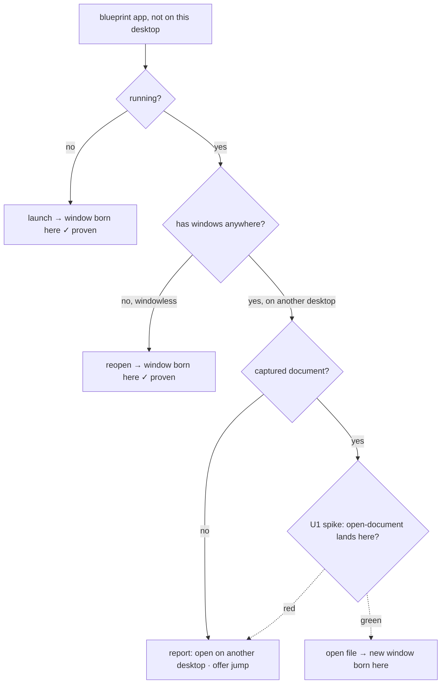

# feat: Per-app context capture + bring-up strategies

## Summary

Generalize the per-space-links pattern from browsers to **all apps**: capture what each
project app had *open* (its document/file, alongside the bundle ID), and on "Bring up here"
reopen that context on the project's desktop — the same way links now reopen a URL there.
This makes the links feature the first of a family of per-app **open strategies** (plain
launch · reopen · open-document · browser-profile · report-elsewhere), chosen by a pure,
testable decision rather than the inline branching `bringUpApps` does today.

It deliberately does **not** attempt to relocate already-open windows — your own feasibility
work proved that impossible three ways (it needs SIP-off). Instead it *creates* correctly-placed
windows, which is the only thing macOS actually permits. One genuinely-unknown case — can an
*already-windowed-elsewhere* non-browser app spawn a new window on the current Space via
`open -n` / `open <file>` — is gated behind an on-device **spike** (U1) so the design commits to
it only if it's real; the proven slice ships regardless.

---

## Problem Frame

Today a project captures only **which apps** were on its desktop (`Blueprint.bundleIDs`), and
"Bring up here" launches the closed ones, reopens the windowless ones, and — for apps already
running with windows on another desktop — can only **report** "can't relocate." Two gaps:

1. **No context.** It knows *Notes was here*, not *Notes had "Roadmap.md" open*. So bring-up
   can relaunch the app but can't restore what you were actually looking at.
2. **The "running elsewhere" wall.** macOS forbids moving an existing window across Spaces
   (proven: `openApplication`, AppleScript `make new window`, AX-driving the Dock all bounce).
   The browser recipe escaped this by *creating* a new window via `--new-window
   --profile-directory`. The open question is how far that "create, don't move" trick
   generalizes to non-browser apps.

The job: "bring this project's apps up *here*, showing what I had open — in one click,"
honoring the hard macOS limit instead of fighting it.

---

## Requirements

- **R1 — Per-app context capture.** Capturing a desktop records, per app, the document/file it
  has open when discoverable (via Accessibility), not just its bundle ID.
- **R2 — Per-app open strategy.** Each app resolves to one strategy: launch (closed) · reopen
  (windowless) · open-document (has captured file) · browser-profile (links, already shipped) ·
  report-elsewhere (running, windowed elsewhere, nothing reopenable).
- **R3 — Reopen on the right desktop.** Document-app context reopens as a new window born on the
  project's Space (switch→verify→settle, then `open`), mirroring the link recipe.
- **R4 — Ship the proven slice unconditionally.** Closed→launch and windowless→reopen land here
  for any app today; that behavior is preserved and folded into the new strategy model.
- **R5 — Gate the unproven case.** The "already-windowed-elsewhere + has document → reopen here"
  behavior ships only if the U1 spike confirms the new window lands on the current Space.
- **R6 — Honor the macOS limit.** Never attempt to relocate an existing window. When no strategy
  can place a window here, report clearly and (optionally) offer to jump to where it is.
- **R7 — Status feedback.** Bring-up reports outcomes per app (opened / reopened / reopened-doc /
  open elsewhere) on the existing `model.status` line.

---

## Key Technical Decisions

- **KTD1 — Create, don't relocate.** Generalize the links "new window born on the current Space"
  recipe; never move an existing window. Grounded in the feasibility docs (relocation proven
  impossible without SIP-off). (see `docs/solutions/integration-issues/macos-openapplication-activates-app-on-other-space.md`)
- **KTD2 — Capture document context via Accessibility.** Read each app's open document path from
  AX `kAXDocumentAttribute` (per-window), the standard "which file is open" signal — nothing reads
  it today. Reopen via `open`/`open -n <file>`. This is the document-app analogue of links
  capturing URLs.
- **KTD3 — Open strategy is a pure decision.** A new `AppOpenPlan.make` (Core, unit-tested)
  resolves each app to a strategy from its running/windowed state + captured context, mirroring
  `LinkOpenPlan.make`. `AppModel` only executes the plan; the branching is not buried in the
  orchestration.
- **KTD4 — Spike-gate the unknown, ship the proven.** Closed→launch and windowless→reopen land
  here for any app (proven) and ship unconditionally. The "already-windowed-elsewhere + document
  → reopen here" path is enabled only on a green U1 spike; if red, those apps fall back to
  report-elsewhere.
- **KTD5 — Persist as bundleID-keyed context, migration-safe.** Store captured context on
  `Blueprint` as a bundleID-keyed dictionary (mirroring `frames`), added with the exact
  `decodeIfPresent ?? default` + `CodingKeys` pattern `links` used — a missing key migrates, a
  malformed value quarantines. Ride the existing passive capture/persist plumbing
  (`refreshCurrentContext` → `SpaceContext` → `persist`) rather than inventing a new loop.
- **KTD6 — One open seam, pure argv builder.** Extend the single `Process`→`open` seam
  (`BrowserLauncher.swift`) for non-browser opens, with a pure argv builder split out like
  `ChromeCommand.arguments` and byte-exact tests. Prefer `open <file>` (and, only where the
  spike proves it lands locally, `open -n`), behind a protocol seam for testability.
- **KTD7 — Reuse capture hygiene.** Keep the `activationPolicy == .regular` owner filter for
  capture — it already drops system agents and our own `.accessory` menu-bar app.

---

## High-Level Technical Design

**Per-app bring-up decision** (for each blueprint app *not already windowed on this desktop*,
after the verified switch + settle). The dashed branch is U1-gated.

**Strategy / capture / proof matrix** — what each app type captures and how it reopens:

| App shape | Captured (R1) | Open strategy (R2) | Proven? |
|---|---|---|---|
| Closed app | bundle ID | launch | ✓ on-device |
| Running, windowless | bundle ID | reopen | ✓ on-device |
| Browser w/ links | URLs (shipped) | browser-profile recipe | ✓ on-device |
| Document app, file open | document path | open-document (`open <file>`) | **U1 spike** |
| Running elsewhere, no context | bundle ID | report-elsewhere (+ jump) | n/a |

**Data flow** (reuses the frames plumbing): capture on the active desktop → `SpaceContext` cache
→ `persist` into `Blueprint` (bundleID-keyed) → `AppOpenPlan.make` reads it → `AppModel` executes
via the open seam. Directional; the per-unit Files sections are authoritative.

---

## Implementation Units

Grouped into three phases: settle feasibility → capture context → decide & open.

### Phase 1 — Settle feasibility

### U1. On-device spike: does open-document/new-instance land on the current Space?

- **Goal:** Settle the one unknown the design hinges on (R5): for a non-browser app **already
  windowed on another desktop**, does `open <file>` (document reopen) and/or `open -n <app>`
  (new instance), fired after a verified switch + settle, birth a new window on the **current**
  Space — or bounce like the browser `make new window` did?
- **Requirements:** R5 (informs R2/R3).
- **Dependencies:** none.
- **Files:** `Spike/` (throwaway probe; no production code) and, on completion,
  `docs/solutions/integration-issues/` (capture the result via `/ce-compound`).
- **Approach:** Probe representative app *types* on-device while settled on a target Space, with
  that app already windowed elsewhere: (a) a single-window document app (e.g. TextEdit/Preview
  with a file), (b) a multi-window editor/terminal, (c) a single-instance app. For each, test
  `open <file>`, `open -n <file>`, and `open -n "<App>"`; record where the new window is born and
  any single-instance breakage / duplicate-instance side effects. Mirror the browser spike's
  rigor (verify the switch landed; note the ~1.5s settle).
- **Execution note:** This is a **spike** — produce a findings note and a go/no-go per strategy,
  not production code. U4/U6's strategy table is finalized from its result; do not build the
  open-document-for-windowed-elsewhere branch until this is green.
- **Test scenarios:** `Test expectation: none — investigation spike; the deliverable is a
  documented on-device result, not testable code.`
- **Verification:** A written result per app type (lands-here / bounces / breaks) and a clear
  decision: which strategies U4 may offer for the already-windowed-elsewhere case.

### Phase 2 — Capture context

### U2. Accessibility document reader

- **Goal:** Read an app's open document file path(s) so capture can record what's open (R1).
- **Requirements:** R1; KTD2, KTD7.
- **Dependencies:** none (parallel with U1).
- **Files:**
  - `ParallelDesktops/Sources/ParallelDesktopsCore/System/AppInspector.swift` (extend) or a new
    `AppContextReader.swift` in `System/`
  - `ParallelDesktops/Tests/ParallelDesktopsCoreTests/CoreTests.swift`
- **Approach:** Add a reader that, per running app (by pid), walks `kAXWindowsAttribute` and reads
  `kAXDocumentAttribute` (file URL/path) and per-window `kAXTitleAttribute`, returning a small
  value type (e.g. `[bundleID: AppContext]` where `AppContext` holds document paths). Degrade to
  empty when AX is untrusted (mirror `AXTitleReader`/`windowCount` nil-handling). Keep the AX call
  behind the existing `AppInspector`-style API; split any pure normalization (e.g. AX value →
  clean file path) into a testable function.
- **Patterns to follow:** `AXTitleReader.focusedWindowTitle()`, `AppInspector.windowCount(pid:)`,
  the `activationPolicy == .regular` filter, the pure-helper-plus-thin-AX-call split.
- **Test scenarios:**
  - Pure path normalization: an AX document value (`file://…/Roadmap.md`) → clean POSIX path;
    a nil/empty AX value → no context (not a crash).
  - An app with multiple document windows → multiple paths captured, de-duplicated.
  - AX untrusted → reader returns empty, no throw (mirrors `windowCount` nil).
  - `Test expectation:` the live AX traversal is verified on-device (system call, not unit-tested);
    only the pure normalization is unit-tested.
- **Verification:** On-device, capturing a desktop with a document app open records the file path;
  the pure normalization tests pass.

### U3. Blueprint per-app context model + capture wiring

- **Goal:** Persist captured per-app context, migration-safe, and write it during capture (R1).
- **Requirements:** R1; KTD5.
- **Dependencies:** U2.
- **Files:**
  - `ParallelDesktops/Sources/ParallelDesktopsCore/Model/Project.swift` (add `AppContext` +
    `Blueprint.appContext: [String: AppContext]`)
  - `ParallelDesktops/Sources/ParallelDesktops/AppModel.swift` (write context in
    `saveCurrentDesktopAsProject` / `updateApps`, and via the `refreshCurrentContext` → `persist`
    passive path)
  - `ParallelDesktops/Tests/ParallelDesktopsCoreTests/CoreTests.swift`
- **Approach:** Add a small `AppContext` Codable value (e.g. `{ documentPaths: [String] }`) and a
  bundleID-keyed `appContext` dict on `Blueprint`, exactly mirroring how `links` was added:
  a `CodingKeys` case + `decodeIfPresent(...) ?? [:]` in `Blueprint.init(from:)`, `encode` stays
  synthesized. Capture (`saveCurrentDesktopAsProject`/`updateApps`) merges U2's reader output for
  the captured bundle IDs; the passive `persist` path updates context for blueprint apps the same
  way it already updates `frames`.
- **Patterns to follow:** the `links` migration pair in `Project.swift` and its two tests
  (`testMissingLinksKeyDecodesToDefaultsNotQuarantined`, `testMalformedLinksValueIsQuarantined`);
  the `frames` capture/persist plumbing.
- **Test scenarios:**
  - Round-trip: a project with `appContext` survives write→reopen across two `ProjectStore`s,
    paths and order preserved.
  - **Migration boundary:** an old `projects.json` with no `appContext` key decodes to `[:]` (not
    quarantined); a present-but-malformed `appContext` value still quarantines.
  - Re-capture replaces an app's context cleanly (no stale-path accumulation).
- **Verification:** New round-trip + migration tests pass; existing `ProjectStoreTests` unaffected;
  `schemaVersion` unchanged.

### Phase 3 — Decide & open

### U4. Pure `AppOpenPlan` decision logic

- **Goal:** Resolve each blueprint app to a strategy (R2), encoding the decision tree as pure,
  tested logic.
- **Requirements:** R2, R4, R5, R6; KTD3, KTD4.
- **Dependencies:** U1 (its result fixes the windowed-elsewhere branch), U3.
- **Files:**
  - `ParallelDesktops/Sources/ParallelDesktopsCore/Model/AppOpenPlan.swift` (new)
  - `ParallelDesktops/Tests/ParallelDesktopsCoreTests/CoreTests.swift`
- **Approach:** A pure `AppOpenPlan.make(bundleID:isRunning:windowState:context:spikeAllowsDocReopen:)
  -> AppOpenStrategy` returning an enum: `.launch`, `.reopen`, `.openDocument(paths)`,
  `.reportElsewhere`. (`windowState` = none / hereAlready / elsewhere, derived by `AppModel` from
  `AppInspector`.) Mirror `LinkOpenPlan.make`. The `spikeAllowsDocReopen` flag (constant set from
  U1's result) gates the `.openDocument` branch for the elsewhere case; when false those apps
  resolve to `.reportElsewhere`.
- **Patterns to follow:** `LinkOpenPlan.make` (pure decision returning a value the model executes);
  the launch-dedupe `AppLauncher.toLaunch` test style.
- **Test scenarios:**
  - Not running → `.launch`; running + windowless → `.reopen`.
  - Running + windowed elsewhere + has document + spike-allowed → `.openDocument(paths)`.
  - Running + windowed elsewhere + has document + spike-disallowed → `.reportElsewhere`.
  - Running + windowed elsewhere + no document → `.reportElsewhere`.
  - Self (our own bundle ID) is never planned (skipped upstream) — assert the caller's filter or
    a guard.
  - Document paths preserved/de-duplicated in `.openDocument`.
- **Verification:** Decision tests pass for every branch of the matrix; flipping the spike flag
  flips only the windowed-elsewhere-with-document case.

### U5. Non-browser open seam (pure argv builder + Process runner)

- **Goal:** Execute `.launch` / `.reopen` / `.openDocument` via `open`, with a tested argv builder
  (R3).
- **Requirements:** R3, R6; KTD6.
- **Dependencies:** U1 (whether `-n` is used), U4 (the strategy it executes).
- **Files:**
  - `ParallelDesktops/Sources/ParallelDesktopsCore/System/BrowserLauncher.swift` (extend) or a new
    `AppLauncher`-adjacent opener in `System/`
  - `ParallelDesktops/Tests/ParallelDesktopsCoreTests/CoreTests.swift`
- **Approach:** Add a pure argv builder (e.g. `AppOpenCommand.arguments(strategy:)`) producing the
  exact `open` argv — `open <file>` for a document, `open -n …` only for strategies the U1 spike
  proved land locally. Run it behind a protocol method (extend `URLOpening` or a sibling
  `AppOpening`), mirroring `SystemURLOpener.openChrome` (`Process` → `/usr/bin/open`,
  `waitUntilExit`, `terminationStatus == 0`). Keep `AppLauncher.launch` (NSWorkspace) for the
  plain `.launch`/`.reopen` cases it already handles well; the new builder is for document opens.
- **Patterns to follow:** `ChromeCommand.arguments` (byte-exact pure builder) + `SystemURLOpener`
  (thin Process runner); the `URLOpening` protocol seam.
- **Test scenarios:**
  - `.openDocument(["~/a.md"])` → exact argv `["<file>"]` (or `["-n", …]` per spike) — byte-exact.
  - Multiple document paths → all appended in order.
  - Empty/again-absent path → builder yields a no-op vector (caller treats as nothing to open).
  - Paths with spaces are a single argv token (not split) — mirrors the profile-folder guard.
- **Verification:** Argv tests pass; on-device, executing an `.openDocument` plan opens the file in
  a new window on the current Space (contingent on U1).

### U6. Wire `AppOpenPlan` into bring-up + status

- **Goal:** Replace the inline three-case branching in `bringUpApps` with the plan + executor, and
  report per-app outcomes (R4, R6, R7).
- **Requirements:** R4, R6, R7; KTD3.
- **Dependencies:** U1, U4, U5.
- **Files:**
  - `ParallelDesktops/Sources/ParallelDesktops/AppModel.swift` (`bringUpApps`)
- **Approach:** After the verified switch + settle, for each blueprint app build `windowState`
  from `AppInspector` and call `AppOpenPlan.make`, then execute: `.launch`/`.reopen` via
  `AppLauncher.launch`, `.openDocument` via U5's opener (with a settle before the first
  document open, matching the link recipe), `.reportElsewhere` accumulates the "open on another
  desktop" list. Compose status counts (opened / reopened / reopened N docs / N elsewhere) and
  keep folding links in (the existing `switchSettleOpen`/`combineBringUp`). Set the
  `spikeAllowsDocReopen` constant from U1.
- **Execution note:** `AppModel` orchestration is verified on-device, consistent with the existing
  `bringUpApps` (the app target isn't unit-tested); the decision logic it calls is covered by U4.
- **Patterns to follow:** the existing `bringUpApps` switch+verify gate, `combineBringUp`,
  `describeSwitch`; the links `switchSettleOpen` settle timing.
- **Test scenarios:** `Test expectation: none — view/orchestration in the app target. The decision
  (U4), argv (U5), and persistence (U3) are unit-tested in Core; bring-up is verified on-device:
  a project with a closed app, a windowless app, a document app open elsewhere, and an app running
  elsewhere with no context produces the four expected outcomes.`
- **Verification:** On-device, "Bring up here" launches closed apps here, reopens windowless ones,
  reopens captured documents here (if U1 green), and reports the rest — with accurate status.

---

## Scope Boundaries

### Not in scope (hard limits / product identity)

- **Relocating already-open windows** across Spaces — proven impossible without SIP-off; the whole
  design is "create, don't move."
- **Window layout / position restore** — `frames` stay passively recorded, not acted on. Placing
  windows at exact coordinates is a separate concern.
- **Browser tab capture** — tab URLs aren't cleanly AX-readable; links remain manually authored
  (already shipped). This plan captures *document* context, not browser tabs.

### Deferred to follow-up work

- **Per-app UI surfacing** — showing each app's captured document(s) in the popover, or a per-app
  strategy indicator. v1 surfaces outcomes only via the bring-up status line.
- **Multi-window / multi-document richness** — capturing and restoring *all* windows of a
  multi-window app, or window roles. v1 captures the document path(s) it can read.
- **Non-document app context** — apps with neither a file nor a URL (e.g. a chat app on a specific
  channel) have no reopenable context in v1; they stay `report-elsewhere`.
- **"Jump to where it is"** affordance for `report-elsewhere` apps (switch to the app's Space).

---

## Open Questions

- **Q1 — The U1 feasibility result (execution-time).** Whether `open <file>` / `open -n` lands a
  new window on the current Space for an already-windowed-elsewhere app is unproven; the docs give
  no positive evidence and the browser `make new window` bounced. U1 settles it; the design ships
  the proven slice regardless and gates only the windowed-elsewhere-with-document branch.
- **Q2 — `open -n` side effects (resolve in U1/U5).** New-instance launches can break
  single-instance apps or create duplicate instances / orphaned document state. Decide per app
  type from the spike whether `-n` is safe, or restrict to `open <file>` (no `-n`).
- **Q3 — AX permission dependency.** Document capture needs Accessibility trust (already required
  for switching). Define behavior when AX is untrusted: capture simply records no context (graceful
  degrade), matching `windowCount`/title readers.

---

## Risks & Dependencies

- **Feasibility risk (central).** The headline "reopen any app's document on the right desktop"
  rests on U1. If red, value narrows to capture + the proven launch/reopen slice + document reopen
  *only* for closed/windowless apps. Mitigation: spike first; ship the proven slice unconditionally.
- **`open -n` breakage.** Single-instance apps may refuse or misbehave under `-n`. Mitigation:
  Q2 spike gating; prefer `open <file>` without `-n` where it suffices.
- **AX fragility.** Document attributes vary by app (some non-document apps expose nothing).
  Mitigation: treat missing context as "no strategy beyond launch/reopen"; never assume a path.
- **Persistence regression.** A non-migration-safe `appContext` field would quarantine every
  existing `projects.json`. Mitigation: KTD5 + U3's migration test pair (the `links` guardrail).
- **Dependency:** builds directly on the shipped per-space-links seams (`LinkOpenPlan`,
  `URLOpening`/`SystemURLOpener`, the `Process`→`open` shell-out, the switch+settle gate) and the
  passive frames capture/persist plumbing.

---

## Sources & Research

- **App-window placement limit (the wall):**
  `docs/solutions/integration-issues/macos-openapplication-activates-app-on-other-space.md` —
  relocation impossible 3 ways; launch/reopen land here; capture-hygiene filter.
- **The recipe being generalized:**
  `docs/solutions/integration-issues/macos-per-space-url-opening-needs-windowless-browser-profile.md`
  — switch→settle→new-window-on-current-Space; decisive factor not isolated; browser-only lever.
- **Spaces access constraints:** `docs/solutions/tooling-decisions/macos-private-cgs-spaces-access.md`.
- **Testing convention:** `docs/solutions/architecture-patterns/protocol-seams-for-untestable-system-calls.md`.
- **Code seams extended:** `ParallelDesktops/Sources/ParallelDesktops/AppModel.swift` (`bringUpApps`,
  capture, `refreshCurrentContext`/`persist`);
  `ParallelDesktops/Sources/ParallelDesktopsCore/System/{AppInspector,AppLauncher,AXTitleReader,BrowserLauncher}.swift`;
  `ParallelDesktops/Sources/ParallelDesktopsCore/Model/{Project,LinkOpenPlan}.swift`;
  `ParallelDesktops/Tests/ParallelDesktopsCoreTests/CoreTests.swift`.
- External web research: **not run** — the placement constraints are already captured on-device in
  `docs/solutions`, and the remaining unknowns are on-device facts the U1 spike settles, not
  web-answerable questions.
