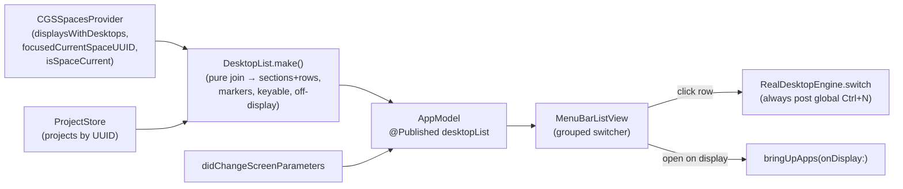

# feat: All-Desktops Switcher

**Origin:** `docs/superpowers/specs/2026-06-24-all-desktops-switcher-design.md` (locked design spec)
**Branch:** `feat/multi-display-spaces` · **Package:** `ParallelDesktops/` (Swift 6, SwiftPM, XCTest)
**Depth:** Standard · Paths are relative to the `macDesktops/` project root.

## Summary

Turn the menu from a saved-projects list into a switcher over **every live desktop across all
displays**. Each row joins a live desktop (from the CGS read) with its saved Project (if any):
named desktops show the project, unnamed ones show "Desktop N". Click switches (global Ctrl+N,
always post). Add reopen-to-relocate onto any display, name-in-place, and auto-heal on
display connect/disconnect. The Project is the durable anchor; the desktop is a disposable
surface. Builds on the already-shipped B-global seam — this plan adds the join model, a switch
simplification, the relocate path, and the UI.

---

## Problem Frame

The app only lists *saved projects*, all of which currently sit on the primary display, so
desktops on a secondary display (iPad/external) are invisible and unreachable from the menu —
the user can't see them, switch to them, or name them. The underlying B-global switch already
reaches any display (proven live); the gap is purely that the UI is project-centric instead of
desktop-centric. Meanwhile macOS forbids moving/creating Spaces and moving windows between
Spaces (all SIP-gated), so the design must live entirely inside **read + switch + open**.

---

## Requirements (trace to origin spec)

- **R1** List all live desktops across displays, grouped by display, flat global Ctrl+N numbering. (spec: The list / Layout)
- **R2** Named desktop → project name+icon; unnamed → "Desktop N". (spec: The list)
- **R3** Markers: `◉` focused-display current, `◐` other-display current, `○` not current; active rows highlighted. (spec: Layout)
- **R4** Click → switch via global Ctrl+N, **always post** (no already-current short-circuit); accept the one no-visible-move no-op. (spec: Behaviors / E2)
- **R5** Name/assign an unnamed desktop in place (bind a Project to its UUID), nameable even when not focused on it. (spec: Name / assign)
- **R6** A project whose desktop is gone shows in "Not on any display" with reassign / open-here; never silently dropped. (spec: E1, E5)
- **R7** Reopen/relocate a project onto a chosen display's desktop (links high-fidelity, native best-effort). (spec: Open / relocate)
- **R8** Auto-heal: recompute drift + display map on `didChangeScreenParameters`. (spec: Auto-heal)
- **R9** Edge handling: >9 greyed/can't-switch; empty-UUID shows "no stable ID", naming disabled, switch best-effort. (spec: E3, E4)
- **R10** Menu-bar label stays a single focused-display value (no change needed). (spec: Menu-bar label)

---

## Key Technical Decisions

- **A pure join model is the new core.** A `DesktopList` value type computed from
  `(displaysWithDesktops(), focusedCurrentSpaceUUID(), projects)` → ordered display sections of
  rows. Pure and fully unit-testable against the existing `FakeMultiDisplaySpaces`; the IO lives
  behind the already-built `SpacesProvider` seam. Rationale: keeps all branching logic (marker
  state, keyable, named/unnamed, global index) out of the view and out of CGS.
- **Markers derive from existing reads — no new IO.** `◉ = uuid == focusedCurrentSpaceUUID`,
  `◐ = isSpaceCurrent && != focused`, else `○`. Both reads already exist and are verified.
- **Switch simplification deletes code.** Drop the "already current on any display → skip post"
  short-circuit in `RealDesktopEngine.switch`; always post for a trackable, keyable desktop. The
  already-on-target case becomes a harmless post (verification still returns `.switched`). This
  changes one existing test's expectation (it asserted no post when already on target).
- **Reopen reuses `bringUpApps`.** Generalize the existing on-demand bring-up to target a chosen
  display's desktop (switch there, settle, open recipe) rather than only the current desktop.
- **Auto-heal is free given UUID persistence.** A `didChangeScreenParameters` observer that calls
  the existing `recomputeDrift` (which already recomputes the display map) is all that's needed —
  returning displays bring back the same UUIDs, so projects un-drift automatically.

---

## High-Level Technical Design

Data flow — the join model is the new seam between reads and the view:

Row state (per desktop): `{ globalIndex, displayOrdinal, displayName, marker(focused|other|none),
binding(project | unnamed | emptyNoID), keyable(globalIndex ≤ 9) }`. Plus an off-display set:
projects whose `spaceUUID` is not in any live display.

---

## Implementation Units

### U1. Desktop-list join model (pure, unit-tested)

**Goal:** A pure value type that joins live desktops with saved projects into ordered display
sections of typed rows, plus the off-display project set. This is the feature's core logic.
**Requirements:** R1, R2, R3, R6, R9.
**Dependencies:** none (uses existing `SpacesProvider` seam + `SpaceIdentity`).
**Files:**
- Create: `ParallelDesktops/Sources/ParallelDesktopsCore/SpacesEngine/DesktopList.swift`
- Test: `ParallelDesktops/Tests/ParallelDesktopsCoreTests/CoreTests.swift` (new `DesktopListTests`)

**Approach:** `DesktopList.make(spaces:projects:)` reads `displaysWithDesktops()` and
`focusedCurrentSpaceUUID()` once, walks displays in order assigning a running global index
(counting empties, as macOS does), and emits sections `[DisplaySection]` each with
`[DesktopRow]`. Each row carries: `globalIndex`, `displayOrdinal`, `displayName`,
`marker` (focused/other/none via the existing reads), `binding` (`.project(Project)` when a
project's `spaceUUID` matches and is trackable, `.emptyNoID` when untrackable, else `.unnamed`),
and `keyable = globalIndex <= 9`. Separately compute `offDisplayProjects` = projects whose
`spaceUUID` is not present (and trackable) across any section. Friendly `displayName` is injected
by the caller (AppModel, via `NSScreen`) — the pure model takes display names as input so it
stays testable; default to "Display N".

**Patterns to follow:** mirror the existing pure helpers in `SpacesProvider.swift`
(`globalIndex`, `displayOrdinal`) and the fake-driven tests already in `CoreTests.swift`
(`MultiDisplayReadTests`, `DisplayMappingTests`).

**Test scenarios:**
- Two displays, mixed named/unnamed → sections in display order; global indices continuous
  (1,2,3 / 4,5); named rows carry their project, unnamed carry `.unnamed` with the right number.
- Marker assignment: the focused display's current row is `.focused`; another display's current
  is `.other`; all others `.none`. Covers R3.
- Empty-UUID desktop in a display → row `binding == .emptyNoID`, still counted in global index,
  `keyable` reflects its position. Covers E4/R9.
- `keyable == false` for global index 10+. Covers E3/R9.
- A project whose `spaceUUID` matches no live desktop → appears in `offDisplayProjects`, not in
  any section. Covers E1/R6.
- A project bound to an empty/untrackable uuid is treated as off-display (never matched). Guards
  the empty-UUID invariant.
- `displaysWithDesktops().flatMap` order equals the row order across sections (consistency).

**Verification:** `DesktopListTests` pass; the model reproduces the spec's "live map" example
(Build #1 D1, Main #2 D1, Desktop 3 #3 D1, Research #4 D2, Desktop 5 #5 D2; Comms off-display).

---

### U2. Switch simplification — always post the global Ctrl+N

**Goal:** Remove the "already current on any display → skip post" short-circuit so a clicked
desktop always posts its global Ctrl+N; keep the untrackable/absent → drift guards and the
bounded verification.
**Requirements:** R4 (and E2).
**Dependencies:** none.
**Files:**
- Modify: `ParallelDesktops/Sources/ParallelDesktopsCore/SpacesEngine/RealDesktopEngine.swift`
- Test: `ParallelDesktops/Tests/ParallelDesktopsCoreTests/CoreTests.swift` (`SwitchEngineTests`, `MultiDisplaySwitchTests`)

**Approach:** In `switch(toSpaceUUID:)` keep the leading `SpaceIdentity.isTrackable` guard, the
`globalIndex` resolve (nil → `.driftDetected`), and the `≤ 9` cap; **delete** the
`if spaces.isSpaceCurrent(uuid) { return .switched(0) }` pre-post short-circuit so the post always
fires. Verification loop (poll `isSpaceCurrent`) is unchanged — when already current it returns
`.switched` immediately. The accepted no-op (clicking a desktop already showing on a non-focused
display) needs no special code: we post, macOS does nothing visible, verify passes.

**Execution note:** test-first — update the existing expectation before changing the engine.

**Test scenarios:**
- Already on the target (focused display) → now **posts** the global index and returns
  `.switched` (replaces `testAlreadyOnTargetShortCircuitsWithoutPosting`'s old "no post" assert).
- Switch to a desktop on another display still posts the correct global index and returns
  `.switched` (existing `MultiDisplaySwitchTests` stay green).
- Untrackable target (`""`) → `.driftDetected`, nothing posted (unchanged).
- Absent uuid → `.driftDetected`, nothing posted (unchanged).
- Global index > 9 → `.notKeyable`, nothing posted (unchanged).

**Verification:** full `SwitchEngineTests` + `MultiDisplaySwitchTests` green with the updated
already-current expectation; no other suite regresses.

---

### U3. AppModel: publish the desktop list + screen-change auto-heal

**Goal:** Expose the joined `DesktopList` as published state for the view, injecting friendly
display names; observe display connect/disconnect to auto-heal.
**Requirements:** R1, R3, R6, R8, R10.
**Dependencies:** U1.
**Files:**
- Modify: `ParallelDesktops/Sources/ParallelDesktops/AppModel.swift`

**Approach:** Add `@Published var desktopList: DesktopList`. Compute it in the existing
`refreshDisplayMap()` (rename/extend to build the full list) from `spaces` + `projects`, passing
friendly names resolved via `NSScreen.screens` (`localizedName`) keyed by display order, default
"Display N". Keep the existing refresh triggers (menu-open via `refreshFocusedProject`,
app-activate, drift). Add a `NSApplication.didChangeScreenParametersNotification` observer in
`registerObservers()` that calls `recomputeDrift()` (which recomputes the map) so a
connect/disconnect re-derives presence — projects on a returning display un-drift automatically
because their UUIDs persist. Menu-bar label (`MenuBarLabel`) is unchanged (R10).

**Patterns to follow:** the existing `registerObservers()` observer blocks (`activeSpaceDidChange`,
`didActivateApplication`) and `refreshDisplayMap()`.

**Test expectation:** none for the IO/notification wiring (not unit-testable; covered by U6
manual acceptance). The pure list shape is already covered by U1.

**Verification:** app builds; opening the menu reflects the current displays; unplugging/replugging
a display updates the list without manual action (confirmed in U6).

---

### U4. Reopen / relocate a project onto a chosen display

**Goal:** Generalize the existing `bringUpApps` so a project can be instantiated on a chosen
display's desktop (switch there, settle, open the recipe), and provide "Open on this screen" when
a project's desktop is gone.
**Requirements:** R6, R7.
**Dependencies:** U2 (switch), U3 (model).
**Files:**
- Modify: `ParallelDesktops/Sources/ParallelDesktops/AppModel.swift`

**Approach:** Extract the target-desktop selection in `bringUpApps`/`switchSettleOpen` so it can
aim at a chosen desktop UUID (any display) rather than only `project.spaceUUID`. Add
`func openProject(_:onDesktopUUID:)` that: switches to that desktop (engine, always-post), waits
the existing settle interval, then runs the existing open/launch recipe (links via the Chrome
profile recipe — deterministic; native apps best-effort, new windows only). For a gone-desktop
project, "Open on this screen" binds the project to the focused display's current desktop
(reuse `recalibrate`'s focused + `isTrackable` guard) then opens the recipe; surface a clear
status when reconstruction is best-effort. Optionally rebind the project's home to the new desktop.

**Patterns to follow:** existing `switchSettleOpen`, `bringUpApps`, `recalibrate`, and the
`LinkOpenPlan`/Chrome recipe; honor `Self.linkSettleNanos`.

**Test expectation:** none directly (depends on real WindowServer + app launching); the
deterministic link-planning portion is already covered by existing `LinkOpenPlanTests`. Behavior
verified in U6.

**Verification:** from the MacBook, "Open on → iPad" puts the project's links on an iPad desktop;
a gone-desktop project's "Open here" reconstitutes on the current desktop with an honest message.

---

### U5. UI — rebuild the menu as the grouped all-desktops switcher

**Goal:** Replace the project-only list with the flat, globally-numbered, display-grouped switcher
from the spec: markers + active-row highlight, "Desktop N" for unnamed, greyed >9, empty-UUID
label, "Not on any display" group with open/reassign, inline name/assign, and "Open on → [display]".
**Requirements:** R1, R2, R3, R4, R5, R6, R7, R9.
**Dependencies:** U3 (publishes `desktopList`), U4 (relocate action).
**Files:**
- Modify: `ParallelDesktops/Sources/ParallelDesktops/MenuBarListView.swift`

**Approach:** Drive the list from `model.desktopList` instead of `model.projects`. Render each
`DisplaySection` with a divider label (`Display N · <friendly name>`), then its rows: marker glyph
(`◉`/`◐`/`○`) + global number + icon/name (italic "Desktop N" when unnamed, "Desktop N · no
stable ID" when empty), with active rows tinted. Click a keyable row → `model.enter` (always-post
switch); a `>9` row is non-interactive with a "can't switch" hint; an empty-UUID row switches
best-effort but disables naming. Hover actions: **Name…** (inline field, like the existing rename
pattern) on unnamed rows → `saveCurrentDesktopAsProject`/assign by UUID; `•••` manage on named
rows (existing); **Open on → [display]** affordance → U4. Render the "Not on any display" group
from `desktopList.offDisplayProjects` with **Open here / Reassign**. Keep `MenuBarLabel` unchanged.

**Patterns to follow:** the existing `projectRow`/`projectRowMain`, the rename inline-field
pattern, `Palette` styling, and the prototype `docs/superpowers/specs/2026-06-24-all-desktops-switcher-mockup.html`.

**Test expectation:** none (SwiftUI view); visual behavior verified in U6. All row-state logic it
renders is already unit-tested in U1.

**Verification:** menu shows every live desktop grouped by display with correct markers/numbers;
unnamed desktops switch and can be named; >9 and empty-UUID render per spec; off-display projects
offer reassign/open-here.

---

### U6. Manual acceptance on the real 2-display (iPad) rig

**Goal:** Verify the IO/UI/notification behavior that can't be unit-tested, on the real rig.
**Requirements:** all (end-to-end).
**Dependencies:** U1–U5.
**Files:** none (manual).

**Checklist:**
- Menu lists all desktops on both displays, grouped, continuous global numbers, correct markers
  (`◉` focused, `◐` iPad current).
- Click an iPad desktop → it switches on the iPad; click the focused-display current → posts,
  no error; click a desktop already showing on the iPad → no visible move (accepted no-op).
- Name an unnamed iPad desktop → becomes a project bound to its UUID; reopen later switches to it.
- "Open on → iPad" puts a project's links on an iPad desktop; "Open here" reconstitutes a
  gone-desktop project with an honest best-effort message.
- Unplug/replug the iPad → its desktops leave/return; a project on it drifts then **auto-un-drifts**
  on reconnect with no manual action.
- >9 total desktops → 10th greyed, can't switch, no crash. Empty-UUID desktop → "no stable ID",
  naming disabled.
- Then run `superpowers:verification-before-completion`.

**Verification:** all checklist items pass on the 2-display Mac + iPad.

---

## Scope Boundaries

**In:** the join model, switch-always-post simplification, AppModel publish + screen-change
auto-heal, reopen/relocate onto any display, the grouped switcher UI, name-in-place, off-display
group, >9 + empty-UUID handling, friendly display names.

**Deferred to follow-up work:**
- Focus-follow across displays for the E2 no-op.
- Per-project Display-Identifier churn-fallback (UUID auto-heal + reassign covers the common case).
- Multi-glyph / "+N" menu-bar label styles.

**Outside this product's identity (impossible without SIP — do not attempt):** moving a Space
between displays, creating/destroying Spaces programmatically, moving an existing window into a
Space. The design lives entirely inside read + switch + open.

---

## Risks & Constraints

- **Reopen fidelity is app-dependent.** Links/web reconstruct deterministically; native apps are
  best-effort (new windows only — macOS won't move existing windows). Mitigation: prefer switching
  to a live desktop; message reconstruction honestly. (spec E5)
- **Sidecar identity churn.** A rare reconnect under a *new* display identifier won't auto-heal and
  needs manual reassign. Accepted for v1 (deferred churn-fallback). (spec E5)
- **`◉`/`◐` accuracy at menu-open only.** Markers reflect state at open; they don't live-update
  while the menu stays open. Accepted (menus are opened briefly).
- **Empty-UUID desktops** can be switched-to positionally but not verified by UUID → may report
  best-effort; naming is disabled. Handled in U1/U5. (spec E4)

---

## Sources & Research

- Origin spec: `docs/superpowers/specs/2026-06-24-all-desktops-switcher-design.md` (locked).
- Interactive UX prototype: `docs/superpowers/specs/2026-06-24-all-desktops-switcher-mockup.html`.
- Live verification this session: global Ctrl+N switches the iPad (control/treatment test);
  `CGSGetActiveSpace` tracks the focused display; `com.apple.spaces.plist` persists Spaces per
  display identifier (UUIDs survive reconnect); empty-UUID desktops are real.
- Builds on shipped B-global work on `feat/multi-display-spaces` (commits `483ab3a`→`59e610c`):
  `SpacesProvider` seam, `RealDesktopEngine` global switch, AppModel focused-display semantics,
  per-project display badge.
